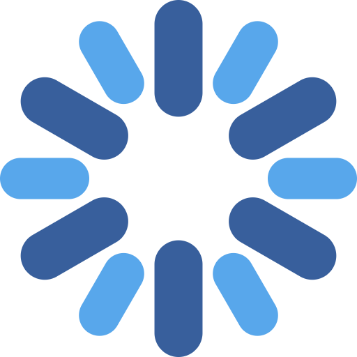
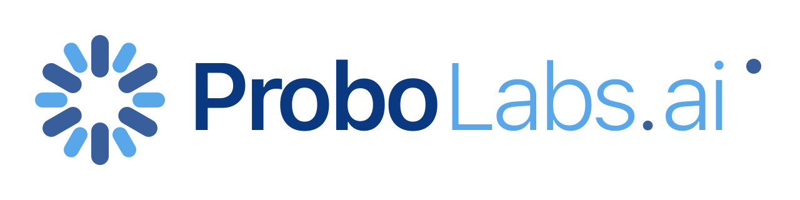
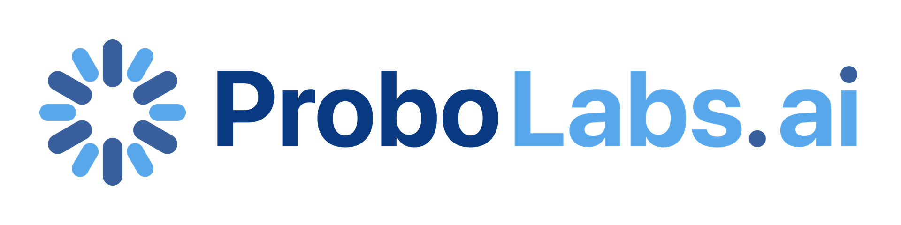
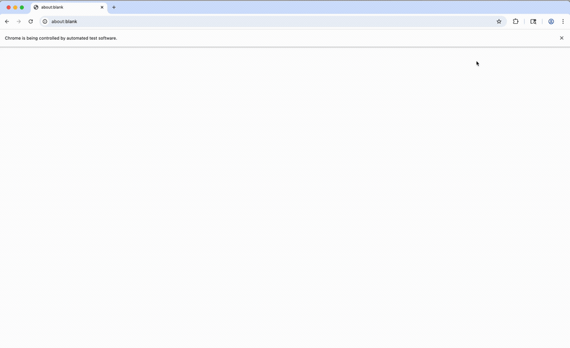

# Probo Design Assets

This repository contains all design assets for ProboLabs products, including logos, icons, and marketing materials.

## 📁 Repository Structure

```
probo-design/
├── logos/                    # Logo files in various formats and sizes
│   ├── archive/              # Archived logo versions
│   └── [logo files]
└── recorder-landing-page/    # Assets for the recorder landing page
    └── [video/gif files]
```

---

## 🎨 Logos

### Flower Logo (Icon)

The flower icon is available in multiple sizes and color variants.

#### Colorful Variants

| Size | PNG | SVG |
|------|-----|-----|
| 16px |  | [SVG](logos/logo-flower.svg) |
| 48px |  | [SVG](logos/logo-flower.svg) |
| 128px |  | [SVG](logos/logo-flower.svg) |
| 512px |  | [SVG](logos/logo-flower.svg) |

#### Monochrome (Black) Variants

| Size | PNG |
|------|-----|
| 16px |  |
| 48px |  |
| 128px |  |
| 512px |  |

**SVG Source:** [logo-flower.svg](logos/logo-flower.svg)

---

### Full Logo (Horizontal)

The full ProboLabs logo with text, available in multiple sizes.

#### PNG Variants

| Size | Preview |
|------|---------|
| 160px |  |
| 320px |  |
| 640px |  |
| 1280px |  |
| 1920px |  |
| Max (Original) |  |

**SVG Source:** [logo-full.svg](logos/logo-full.svg)

---

## 🎬 Recorder Landing Page Assets

### Animated Demo

Animated GIF demonstrating how to start the Probo Recorder extension.



**Source Files:**
- [GIF](recorder-landing-page/start-recorder-app.gif) - Animated GIF (optimized for web)
- [MP4](recorder-landing-page/start-recorder-app.mp4) - Video format
- [MOV](recorder-landing-page/start-recorder-app.mov) - Original video file

---

## 📦 Asset Details

### Logo Files

#### Flower Logo
- **Formats:** PNG, SVG
- **Sizes:** 16px, 48px, 128px, 512px
- **Variants:** Colorful, Monochrome (black)
- **Usage:** Favicons, extension icons, app icons

#### Full Logo
- **Formats:** PNG, SVG
- **Sizes:** 160px, 320px, 640px, 1280px, 1920px, Max
- **Usage:** Headers, marketing materials, documentation

### Video Assets

#### Recorder Demo
- **Formats:** GIF, MP4, MOV
- **Purpose:** Onboarding demonstration
- **Usage:** Landing pages, documentation, tutorials

---

## 🎨 Color Palette

Based on the logo colors:

- **Primary Blue (Dark):** `#385F9C`
- **Primary Blue (Light):** `#58A7EB`
- **Accent Blue:** `#083981`

---

## 📝 Usage Guidelines

### Logo Usage
- Use colorful variants for light backgrounds
- Use monochrome variants for dark backgrounds or when color is not available
- Maintain minimum clear space around logos (recommended: 20% of logo height)
- Do not distort, rotate, or modify the logo proportions

### File Formats
- **SVG:** Use for scalable graphics (web, print at any size)
- **PNG:** Use for fixed-size raster graphics (favicons, app icons)
- **GIF:** Use for animated graphics (web only)
- **MP4/MOV:** Use for video content

---

## 📂 Archive

Historical and deprecated logo versions are stored in the [`logos/archive/`](logos/archive/) directory.

---

## 🔄 Updates

This repository is actively maintained. For requests or updates to design assets, please open an issue or contact the design team.

---

## 📄 License

All design assets in this repository are proprietary to ProboLabs.

